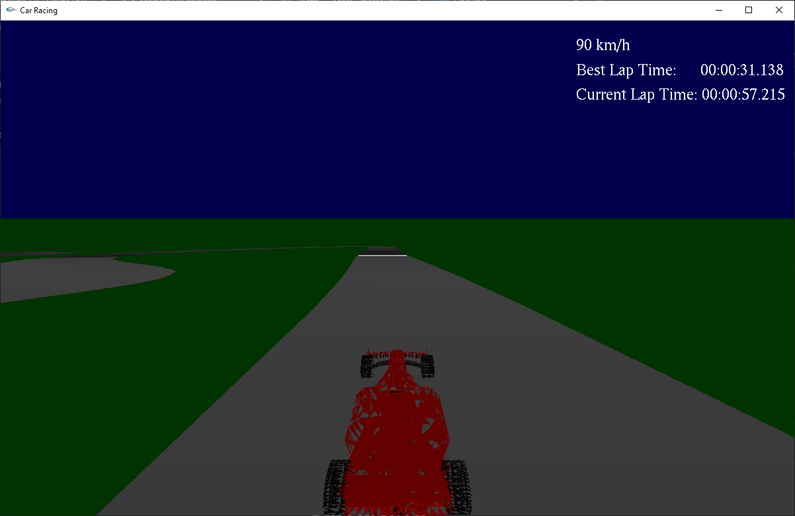

# Car Racing (OpenGL + GLUT)

A 3D racing game for Windows written in **C/C++** using **OpenGL** and **GLUT**.  
The game loads car and track meshes exported from **Blender** (OBJ/MTL), renders them with a simple shader pipeline, and times your laps. Your **chosen car** and **best lap time** are saved in `config.txt`.

## Features

- Three screens: **Start Menu**, **Game**, **Configuration** (switching with internal state)
- Custom **OBJ/MTL loader** for cars, track and finish line
- Shader pipeline (vertex + fragment) compiled at runtime
- Third-person **follow camera** behind the car
- Simple HUD (speed/lap time) and basic background (sky/grass)
- Saving to `config.txt` (selected car + best lap time)

## Controls

- **W / Up Arrow** – Accelerate  
- **S / Down Arrow** – Brake / Reverse  
- **A / Left Arrow** – Steer left (when moving)  
- **D / Right Arrow** – Steer right (when moving)  
- **-** – Toggle wireframe  
- **Q** – Back to menu / quit